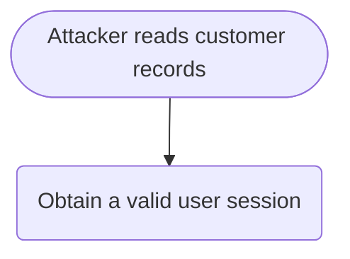

# Attack Tree: [FEATURE NAME]

**Feature**: `[###-feature-name]` · **Generated**: [DATE] · **Profiles**: [default, agentic] · **Scenario**: current · **Canonical**: `attack-tree.yaml`

> Rendered by AttackTree (`attacktree.sh render`). Edit `attack-tree.yaml`, not this file.
> This template documents the layout the engine produces; it is the fallback when the engine cannot run.

## Summary

| Goals | Critical | High | Medium | Low | Attack vectors | Controls (active / planned / proposed) | Requirements | Decisions |
|---|---|---|---|---|---|---|---|---|
| 0 | 0 | 0 | 0 | 0 | 0 | 0 / 0 / 0 | 0 | 0 |

## Threat Actors

| ID | Name | Skill | Resources | Access | Risk appetite | Motivation |
|---|---|---|---|---|---|---|

## Assets

| ID | Name | Type | Classification | Source |
|---|---|---|---|---|

## Goals

### goal.example — [Goal name]

**Impact**: business high, customer critical → **critical** · **Residual risk (current)**: **high** (likelihood 45, strongest actor `actor.outsider`) · **With planned controls**: medium · **Source**: spec.md#FR-003

- **OR** [Goal name]
  - **OR** Obtain a valid user session
    - Phish a user for their session — `actor.outsider` · low · 60 % · cost 500 · CAPEC-98
    - Replay a leaked session token — `actor.outsider` · medium · 40 % · 🛡 `control.short-lived-tokens` (planned)
  - **AND** Read the record
    - Guess a record identifier — `actor.outsider` · trivial · 90 % · 🛡 `control.central-authorization` (implemented)

**Most likely path**: P1 (likelihood 45): phish user + guess record id · **Cheapest path**: P1 (cost 500)
**Choke points**: `node.guess-record-id` · **Achilles heels**: `node.guess-record-id` (in 2 of 2 paths)

| Path | Leaves | Likelihood | Cost | Feasible for | Controls on path |
|---|---|---|---|---|---|

## Controls

| ID | Control | Kind | Attached to | Effect | Cost | Status | Evidence | Requirements | Touchpoints |
|---|---|---|---|---|---|---|---|---|---|

## Roadmap (what-if)

| Rank | Control | Status | Cost | Risk reduction | Depth reduction | Class | Goals affected |
|---|---|---|---|---|---|---|---|

## Control Requirements

### CR-001 (P1) — unverified

[Statement]

- **Given** [precondition], **when** [action], **then** [outcome]
- Controls: `control.example`
- Tasks: — none —

## Risk Decisions

| ID | Target | Status | Owner | Expires | Rationale |
|---|---|---|---|---|---|
